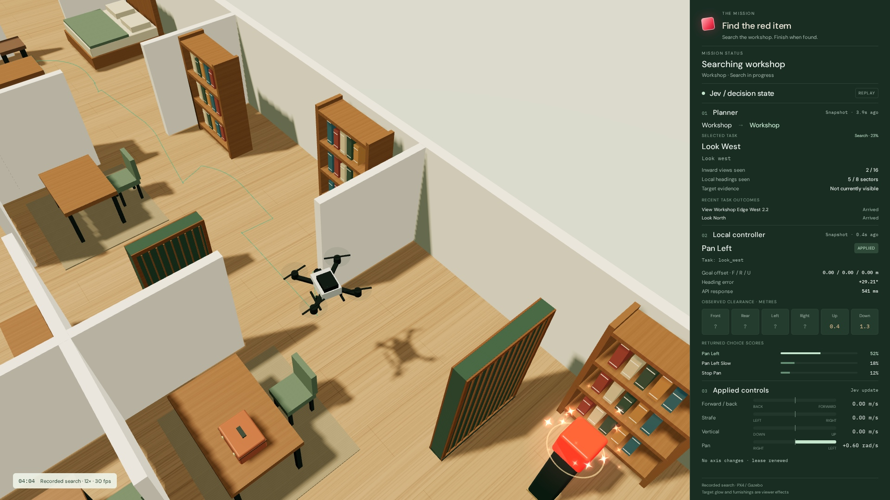

# Jev Drone

Can a fast classification model fly a drone through a house, search a room, and find an item?

This project tests that idea with **Jev via OpenRouter**, an eight-room house in **Gazebo**, and a simulated **PX4 X500 drone**. Jev chooses both the navigation tasks and the movement updates. PX4 handles flight stabilization.



This is a working research prototype. It has completed multi-room searches, but complex missions are still inconsistent. The included recordings show successes, a timeout, and a completion that failed its safety checks.

## Try the demo

You only need Node.js/npm and [uv](https://docs.astral.sh/uv/getting-started/installation/) for the recorded demo. uv runs the Python file server without installing the simulator dependencies. No API key, Docker, or simulator setup is required.

```bash
npm ci --prefix demo
npm start --prefix demo
```

Open **[localhost:8765](http://localhost:8765)**. Follow the drone, explore the house, scrub through the flight, or open **Details** to switch recordings and inspect results.

The **[decision-and-controls view](http://localhost:8765/state.html)** plays the longer room-search recording at 12×. Press **Space** to pause/resume and **R** to restart. It shows the actual request state, returned choices, scores, and applied controls; Jev's hidden reasoning is not available.

Both views replay recorded flights. The furnished scene, target glow, and sparkles are presentation effects, separate from the sensor images used during flight.

## How it works

```text
Gazebo RGB-D cameras + PX4 pose estimate
                  ↓
     Perception and short-term memory
     detections, depth clearance, visited views
                  ↓
     Jev planner → persistent navigation task
                  ↓
     Jev local controller → control updates
                  ↓
     PX4 stabilization → Gazebo drone physics
```

- **Perception:** six simulated RGB-D cameras render at 160 × 120 and 8 Hz. Object detection uses only the front camera. Depth from all six directions supplies obstacle-clearance measurements. Handwritten color detection finds laboratory markers; this does not recognize arbitrary household objects.
- **Location and memory:** the drone receives a PX4 pose estimate using simulated external odometry and a known map of rooms and doors. Furniture and target positions must be observed. Code tracks observations, visited viewpoints, heading coverage, and past positions.
- **Planning:** Jev chooses among supplied task options: enter a room, visit a search viewpoint, approach an observed target, or report an inspection. The task and its progress become input to the local controller.
- **Control:** Jev chooses persistent updates on four signed axes: forward/back, strafe left/right, up/down, and pan left/right. For example, setting forward speed to zero leaves an existing pan command active. Opposite directions share one signed axis.
- **Flight:** PX4 controls the motors. Commands expire after 0.9 seconds without renewal; stale telemetry also stops commanded movement. There is no automatic route solver or collision-avoidance controller replacing Jev's choices.

Jev receives structured facts and a finite set of choices, not camera pixels or an unrestricted action interface. The simulator has ground-truth geometry for rendering and evaluation; the policy receives sensor-derived obstacle and target observations. This is **RGB-D with a known room map**, not a camera-only learned perception system.

## Run a new mission

The native simulator setup targets **Linux with Docker**, Python 3.10, and a multicore CPU. It pins PX4 v1.17.0 to a tested commit and builds a Gazebo Harmonic image. The initial setup downloads and builds substantial dependencies.

Install [uv](https://docs.astral.sh/uv/getting-started/installation/), then run commands from the repository root. `uv sync` creates `.venv` using the checked-in Python version and dependency lockfile:

```bash
uv sync --locked

bash scripts/setup_simulator.sh
cp .env.example .env
```

Add your `OPENROUTER_API_KEY` to `.env`, then run a search:

```bash
bash scripts/run_mission.sh \
  --case house_hidden --seed 5811 \
  --find-only --seconds 1200 --budget 3.5 \
  --out results/my-mission
```

The mission starts away from the workshop and must find its red marker. `--find-only` ends after a verified inspection. Omit it to include the scenario's return objective. `house_reverse` starts at the other end of the house.

`--seconds` limits simulated mission time; `--budget` limits reported API cost in USD, checked after calls. Use a new output directory for each run. An exported `OPENROUTER_API_KEY` or `JEV_KEY_FILE=/absolute/path/to/file.env` also works. Credentials and generated results are ignored by Git.

To run the two find-only demonstration cases:

```bash
uv run --locked python -m jev_drone.sim.suite \
  --protocol experiments/protocols/native/protocol-house-find-video.json \
  --workers 2 --out results/my-batch
```

Each mission records configuration, a source snapshot and hashes, requests and responses, applied commands, trajectory, sensor frames, and contact/safety events.

## What has worked so far?

Two fresh find-only demonstration runs with the v36 policy both passed the strict audit:

| Mission | Verified find, simulated time | Contacts / control-rule violations | Accepted control updates, wall time |
| --- | ---: | ---: | ---: |
| Entry → workshop, seed 5811 | 268 s | 0 / 0 | 1.38 Hz |
| Workshop → entry, seed 5812 | 920 s | 0 / 0 | 1.53 Hz |

These two cases use established furniture layouts and are **not a reliability estimate**. The control rate is measured across the whole mission; the roughly 20 Hz setpoint publisher and 30 fps video are separate rates.

The featured longer search comes from a v39 experiment: it entered the workshop at 216 seconds, first saw the item at 468 seconds, and verified it at 489 seconds. The cinematic replay ends at that find; the interactive recording also includes the return. The default code remains v36 because later variants did not establish more reliable full missions.

The bundled files are compact replay exports, not the complete audit dataset. Raw experiments and sensor archives remain local. No physical drone has been tested.

## Project layout

| Path | Purpose |
| --- | --- |
| [`src/jev_drone/sim/`](src/jev_drone/sim/) | PX4/Gazebo session, scene, sensors, mission runner |
| [`src/jev_drone/control/`](src/jev_drone/control/) | Jev local policy, joystick state, movement instructions |
| [`src/jev_drone/planning/`](src/jev_drone/planning/) | Task selection and search/route memory |
| [`src/jev_drone/perception/`](src/jev_drone/perception/) | Marker detection, depth processing, motion tracking |
| [`src/jev_drone/world/`](src/jev_drone/world/) | Room layouts, furniture, shared world representation |
| [`src/jev_drone/audit/`](src/jev_drone/audit/) | Independent mission and control checks |
| [`src/jev_drone/gateway.py`](src/jev_drone/gateway.py) | Jev API requests and response validation |
| [`demo/`](demo/) | Three.js viewer and selected recordings |
| [`tools/`](tools/) | Replay/video export and experiment analysis |
| [`experiments/`](experiments/) | Protocols, representation probes, PyBullet and earlier analytic prototypes |
| [`tests/`](tests/) | Controller, perception, mission, and browser checks |
| [`scripts/`](scripts/), [`docker/`](docker/) | Simulator setup and launch |

Start with [`control/policy.py`](src/jev_drone/control/policy.py) for the local controller and [`planning/agent.py`](src/jev_drone/planning/agent.py) for task selection. Historical probes often require their original recordings. A protocol records an experiment's settings; reproducing an older policy also requires that run's frozen source.

## Check the setup

Run Ruff and the Python tests with the locked development environment:

```bash
uv run --locked ruff check .
uv run --locked ruff format --check .
uv run --locked pytest -q
```

Use `uv run ruff check --fix .` and `uv run ruff format .` to apply lint fixes and formatting. GitHub Actions runs the same checks on pushes and pull requests. Generated experiments and frozen source snapshots are excluded from Ruff.

Tests that need native simulator dependencies skip on the host. Run the full suite inside the simulator image, which also installs its Python dependencies from `uv.lock`:

```bash
docker run --rm -e PYTHONPATH=/workspace/src \
  -v "$PWD:/workspace" jev-px4:harmonic python3 -m pytest -q
```

For a flight/sensor check without model calls:

```bash
bash scripts/run_mission.sh --body-check --out results/body-check
```

For browser checks, leave the demo server running in another terminal:

```bash
uv run --locked --extra video playwright install chromium
uv run --locked --extra video python -m tests.browser.check_preview
```

## Export your own replay or MP4

Export a completed mission and its Jev state. Supplying multiple paths to `--source` includes multiple recordings in the viewer's menu. This replaces the demo index.

```bash
uv run --locked python -m tools.demo.export_house_demo --source results/my-mission
uv run --locked python -m tools.demo.export_state_replay \
  --source results/my-mission --out demo/data/state-replay.json
```

With the demo server running, render the item-search portion:

```bash
uv run --locked --extra video python -m tools.demo.render_video \
  --speed 12 --out report/my-mission.mp4
```

The exporter renders fixed-time 1080p frames, encodes at 30 fps, then decodes the MP4 to verify frame count, timing, and repeated frames. It also writes a provenance manifest beside the video.

Jev background: [Typesafe's introduction](https://typesafe.ai/blog/introducing-system-one-models-and-jev).
